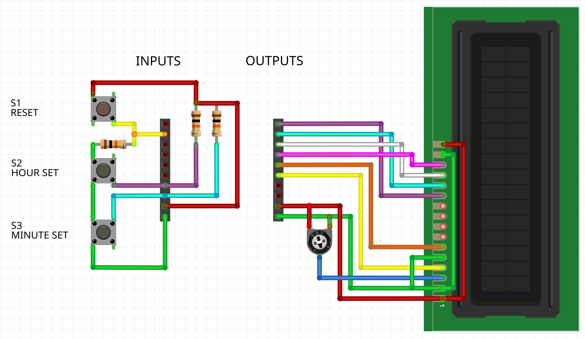

# HD74480 Clock

This design is a minimal LCD clock using the HD74480 character LCDs.  It just fits into the space allowed so features like seconds display, alarm, 12/24hr clock were not possible.

The clock expects a 1000Hz system clock.  The clock is set using two pins to increment the hour and minute.  When the minute is incremented the seconds are zeroed.  Increment occurs on rising edge of the signal (button release in the diagram below).

